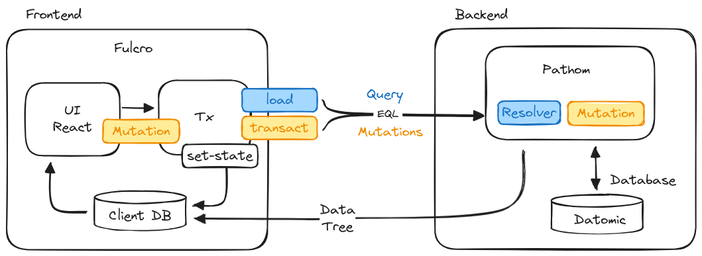

# fulcro_challenge
Building a ToDo app using Fulcro

## Prerequisites

For this project you will need to have on your system:

- Java
- Clojure
- Leiningen
- Node.js
- npm

## Challenges requirements

Build a  Todo APP using Fulcro 

- [ ] Todo app should be able to list the todos, create one, edit one, delete one, anything else fun you can think of.
- [ ] Make fulcro defsc components for the components you need like todo todo-list etc.
    - A component has
        - Ident
        - Initial-state ( at first for testing, then df/load will fill in the data )
        - Query

- [ ] Build the rest of the fulcro components you need
- [ ] Then make mutations in front end to save data to the fulcro state map
- [ ] Connect with backend to save data with mutations and retrieve data with resolvers and load data with df/load
- [ ] Install datomic and save data in the backend to datomic database

## Architecture understanding

Fulcro is a full-stack web framework, these are the main components:

Frontend:

a. UI - Fulcro/React components rendered a DOM and submit mutations to the backend to the Transaction Subsystem (Tx)

b. Tx - The Transaction Subsystem is responsible for receiving mutations from the UI and asynchronously executes local mutations and sends remote mutations to the backend.

c. Local DB - The Local DB is a local in-memory database that holds the application state. (Tx) typically schedules a re-render afterwards. The cached data is turned into a data tree according to the needs of the UI, to feed and render the UI.

Backend:

a. Pathom - Is a Clojure(Script) library that provides a query language (EQL) and a query engine. It is used to query the backend database and return the data to the frontend.

b. Datomic - Is a distributed database that stores data as facts (Inmutable data). It is used to store the application data.

## Helpful links

#### FULCRO Reading over fulcro

Overview (EQL, Pathom, Fulcro) -> https://fulcro-community.github.io/guides/tutorial-eql-pathom-overview/index.html

https://book.fulcrologic.com/

Mutations -> https://book.fulcrologic.com/#_mutations

Idents -> https://book.fulcrologic.com/#_idents
    - https://book.fulcrologic.com/#_passing_callbacks_and_other_parent_computed_data
    - https://book.fulcrologic.com/#_automatic_normalization

Initial state -> https://book.fulcrologic.com/#_initial_state
    - https://book.fulcrologic.com/#_initial_state

Idents and queries -> https://book.fulcrologic.com/#_idents_as_a_query_element

Componets rendering -> https://book.fulcrologic.com/#_components_and_rendering

Query -> https://book.fulcrologic.com/#_query

#### FULCRO inspect

https://chrome.google.com/webstore/detail/fulcro-inspect/meeijplnfjcihnhkpanepcaffklobaal

#### PATHOM Reading over pathom

https://github.com/wilkerlucio/pathom

EQL -> http://edn-query-language.org/

Implementing Om.next -> https://medium.com/@wilkerlucio/implementing-custom-om-next-parsers-f20ca6db1664

#### DATOMIC install this database

https://docs.datomic.com/pro/getting-started/brief-overview.html

dev setup: https://docs.datomic.com/pro/getting-started/dev-setup.html
